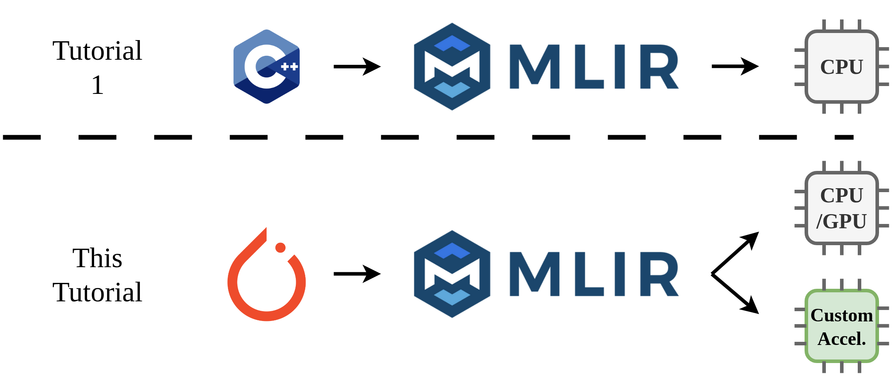
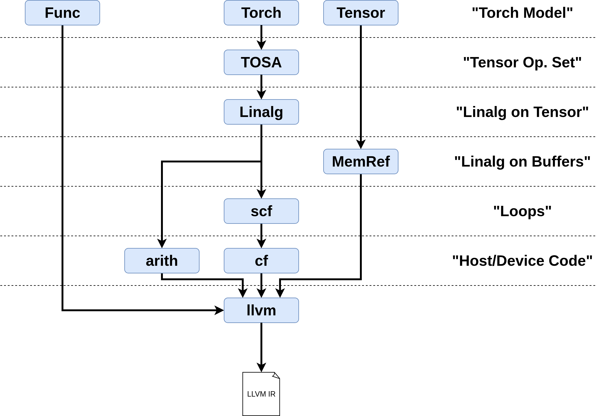
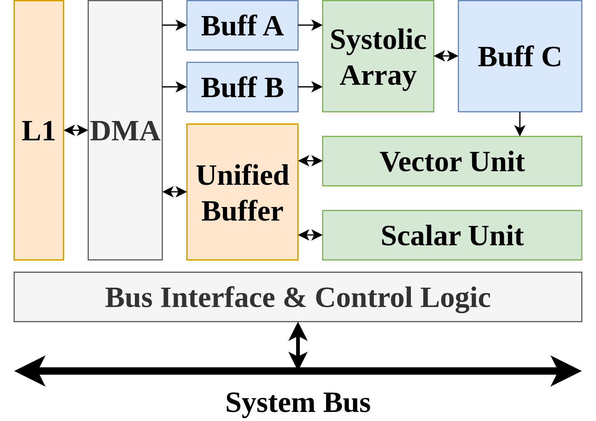
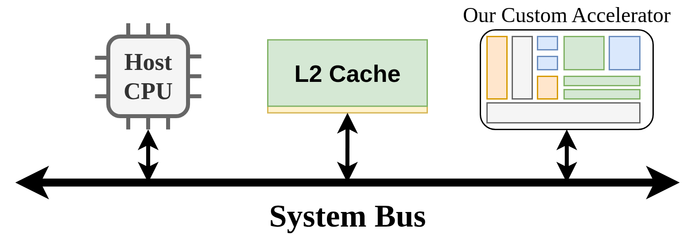

# MLIR Beginner-Friendly Tutorial 2

This is a continuation of my last beginner-friendly tutorial on MLIR, found on GitHub here: https://github.com/AlexandreSinger/mlir-beginner-friendly-tutorial

Part 1 of this tutorial was presented during the weekly Reading Group at the University of Toronto. The recording of this presentation can be found here: [https://youtu.be/Uno_XhtkT5E](https://youtu.be/dae1cvzAoIM)

I wanted to build on my previous tutorial by discussing how MLIR is used in the context of programming hardware accelerators.
Although the first tutorial is not required to follow along with this tutorial, it is recommended that you watch / read the
prior tutorial before this one. The key things from the last tutorial you will need are how to read MLIR's Intermediate Representation, what multi-level means in the context of MLIR, and how different levels are lowered in the MLIR framework.

In the first tutorial, I motivated MLIR by creating a hypothetical C++ library and showing that we can leverage higher levels of abstractions to optimize the code better for targeting CPUs. In this tutorial, I wanted to go a step further and discuss another very common (maybe even the most common) use-case for MLIR: using high-level information to target domain-specific accelerators. The figure below provides an overview of the tutorial:


We will be describing a hypothetical hardware accelerator architecture (based on real accelerator architectures) and its programming model, and then show different techniques on how we can lower high-level graph abstractions into kernels that are run on the accelerator.

This is not intended to be a tutorial on best-practices for hardware accelerators, or frankly even how to write a good compiler for hardware accelerators; my goal in this tutorial is to teach you how you should approach writing a compiler for a hardware accelerator. The best compiler infrastructure depends on the architecture you are targeting and how much time you have to invest on building it.

# Demo 0: Building Torch-MLIR

In this repository, you will find a Git submodule of torch-mlir. This was a recent version of torch-mlir that was available when I wrote this tutorial. There is nothing special about it, I just verified that it worked on the code in this tutorial, so I provide it here such that the results of the tutorial will always match in the future. Make sure you have initialized the submodule using:
```
git submodule update --init --recursive
```
This command may take some time since it also initializes the submodules of torch-mlir, which includes LLVM.

Unlike the last tutorial, which used Bash scripts, this tutorial uses Python scripts to lower code through MLIR. Python makes it much more convenient to work with the torch-mlir passes. The following commands will set up a Python virtual environment and install the necessary python libraries to run the scripts in the demos. It is also required to build LLVM correctly in the next step.
```
python3 -m venv .venv
source .venv/bin/activate
pip install --upgrade pip
pip install -r requirements.txt
```

This tutorial uses the Ninja generator to build torch-mlir, this can be installed using:
```
apt-get install ninja-build
```

After initializing the submodules and installing the necessary Python dependencies, we can build torch-mlir using the following commands.
```
cmake -GNinja -Bbuild \
    -DCMAKE_BUILD_TYPE=Release \
    -DCMAKE_C_COMPILER=clang \
    -DCMAKE_CXX_COMPILER=clang++ \
    -DLLVM_ENABLE_PROJECTS=mlir \
    -DLLVM_EXTERNAL_PROJECTS="torch-mlir" \
    -DLLVM_EXTERNAL_TORCH_MLIR_SOURCE_DIR="$(pwd)/external/torch-mlir" \
    -DMLIR_ENABLE_BINDINGS_PYTHON=ON \
    -DTORCH_MLIR_ENABLE_STABLEHLO=ON \
    -DLLVM_TARGETS_TO_BUILD=host \
    external/torch-mlir/externals/llvm-project/llvm

cmake --build build --target tools/torch-mlir/all mlir-opt mlir-translate llc mlir_runner_utils mlir_c_runner_utils
```

Finally, we will need to update our Python Path to point to the torch-mlir python packages. I think this needs to be done for every terminal instance. There are ways to do this permanently with your python virtual environment, but this is beyond the scope of this tutorial (and is annoying). For now, every session that you want to run these demos, run:
```
export PYTHONPATH="$(pwd)/build/tools/torch-mlir/python_packages/torch_mlir:$PYTHONPATH"
```

These instructions were graciously donated by Robert Luo from his WaferScapeMapper project: https://github.com/robluo/WaferScapeMapper

# Demo 1: Compiling PyTorch Through MLIR Using Torch-MLIR

In the last tutorial, we defined our own CPP library that a user may write in and then converted it directly to MLIR. This was convenient since the library we wrote perfectly matched MLIR's Linalg dialect. A snippet of the user code for a fully-connected layer is copied below:
```cpp
int main(void) {
    Tensor<float, 256, 512> FC_INPUT;
    Tensor<float, 512, 1024> FC_WEIGHT;
    Tensor<float, 256, 1024> FC_OUTPUT = matmul(FC_INPUT, FC_WEIGHT);
    Tensor<float, 256, 1024> OUT = relu(FC_OUTPUT);
}
```

The issue is that people do not want to write in some custom frontend language. People will not be familiar with how to use it to get excellent performance and will likely avoid writing code in a language that they are not familiar with. If you are a chip designer, this is a major issue: you may have created a perfect chip with a programming interface that can achieve incredible performance, but if nobody can actually write in that language your chip will not sell. Our goal is to use a very popular programming interface as our frontend. This will give the highest likelihood of your users being able to use your chips and achieve excellent performance.

In this tutorial, we will be targeting an AI hardware accelerator. One of the most popular frontends for AI is PyTorch. Here is the same fully-connected layer written in PyTorch:
```py
import torch
import torch.nn as nn


class FullyConnected(nn.Module):
    def __init__(self, in_features: int = 512, hidden: int = 1024):
        super().__init__()
        self.layers = nn.Sequential(
            nn.Linear(in_features, hidden),
            nn.ReLU(),
        )

    def forward(self, x: torch.Tensor) -> torch.Tensor:
        return self.layers(x)

    def inputs(self, batch_size: int = 256) -> tuple:
        return (torch.randn(batch_size, self.layers[0].in_features),)
```
Although this looks like more code than the custom library, it uses known PyTorch constructs that people are familiar with. Another major advantage of using PyTorch is code reuse. People can take the same model and target different machines. This lowers the barrier to using your chip even more.

In the rest of this demo, we will be writing a compiler that will lower PyTorch models, through MLIR's Linalg dialect (the same dialect we used in the last tutorial), down to code that can be executed on the CPU of your computer.

The code for this demo can be found in the `demo1` folder. This code was borrowed from [Robert's Waferscape Project](https://github.com/robluo/WaferScapeMapper); which provides an MLIR pipeline for compiling PyTorch models targeting CPUs. I have made some small modifications to make the tutorial easier to follow. You can run the full demo using the following:
```
source .venv/bin/activate

export PYTHONPATH="$(pwd)/build/tools/torch-mlir/python_packages/torch_mlir:$PYTHONPATH"

python3 demo1/run.py
```

This will run the full compilation pipeline and run the compiled result on your machine. It compares the result of the compilation with the regular PyTorch flow to ensure that they get the same result. The intermediate MLIR layers are written out to files in the `demo1/models_mlir` directory.

## 1.1: Using Torch-MLIR to Enter MLIR from PyTorch

Since MLIR provides an extensible infrastructure, many people have defined their own dialects for different applications. Fortunately, many people are writing compilers that use PyTorch as a frontend; so a PyTorch dialect already exists from the [torch-mlir project](https://github.com/llvm/torch-mlir). The Torch-MLIR project provides a PyTorch dialect, which is used to express a high-level PyTorch model in MLIR, and conversion passes to lower the PyTorch Dialect into MLIR's built-in dialects. This tutorial will not go into details on how torch-MLIR works, but we will be using it to lower our fully-connected example above.

We start by using Torch-MLIR to export the PyTorch graph to the `torch` dialect. The Python code to do this can be found in `demo1/frontend.py`. This file uses Torch-MLIR's `torch.export` method to lower the model. The file contains some other oddities that handle lowering special operations and handle buffers more easily; this frontend was borrowed from [Robert's Waferscape Project](https://github.com/robluo/WaferScapeMapper) which was designed to lower much more interesting models.

One interesting thing about the frontend that I want to point out is that in order to export the model into MLIR, you need to provide an example input. This is required because Python (and by extension PyTorch) is a JIT dynamic language, so the model does not have enough information about the size of the input tensors (the tensor size is not known until run time). By providing example inputs, we can use fixed-size tensors in the MLIR code. If we did not provide this, the tensors would have dynamic shape, which are harder to optimize.

This produces the following `torch` dialect code in MLIR:
```mlir
module {
  func.func @main(%arg0: !torch.vtensor<[256,512],f32>) -> !torch.vtensor<[256,1024],f32> {
    %0 = torch.vtensor.literal(dense_resource<torch_tensor_1024_512_torch.float32> : tensor<1024x512xf32>) : !torch.vtensor<[1024,512],f32>
    %1 = torch.vtensor.literal(dense_resource<torch_tensor_1024_torch.float32> : tensor<1024xf32>) : !torch.vtensor<[1024],f32>
    %2 = torch.aten.linear %arg0, %0, %1 : !torch.vtensor<[256,512],f32>, !torch.vtensor<[1024,512],f32>, !torch.vtensor<[1024],f32> -> !torch.vtensor<[256,1024],f32>
    %3 = torch.aten.relu %2 : !torch.vtensor<[256,1024],f32> -> !torch.vtensor<[256,1024],f32>
    return %3 : !torch.vtensor<[256,1024],f32>
  }
}

{-#
  dialect_resources: {
    builtin: {
      torch_tensor_1024_512_torch.float32: "...",
      torch_tensor_1024_torch.float32: "..."
    }
  }
#-}
```
You will notice that this is basically the same information as our PyTorch model, just expressed in MLIR.

NOTE: The dialect resources contain the raw data for the weight matrices directly in the MLIR code. This may not be common; but for this particular lowering pipeline it was convenient to have the tensor data directly.

In its current form, this MLIR code is basically a one-to-one mapping of the PyTorch model, but our goal is to move into more generic dialects so we can perform the optimizations we talked about last tutorial, as well as target different devices.

## 1.2 Lowering the Torch Dialect

We will now lower the PyTorch code to LLVM using a similar technique to the last tutorial. We will be using Python for this lowering instead of Bash since it is just more convenient for torch dialect code; but it is the same process as before. The code for lowering the torch dialect can be found in `demo1/pipeline.py`. An overview of the lowering process is shown here:



The bottom part of this figure (from Linalg on Tensor down to Host/Device Code) is identical to the lowering I showed in the first tutorial. This is the major advantage of MLIR: we are able to reuse our lowering code from another project without issue. The new lowering is at the top.

We lower the `torch` dialect using TorchDynamo to lower to the `torch-backend` dialect (not shown) and then lower it to the TOSA dialect from there. This is a common technique to use an intermediate dialect to make the lowering easier. The TOSA dialect is very similar to the Linalg dialect from before, but it is following the [TOSA specification](https://www.mlplatform.org/tosa/tosa_spec.html). The TOSA code for the fully-connected layer is shown below:
```mlir
module {
  func.func @main(%arg0: tensor<256x512xf32>) -> tensor<256x1024xf32> {
    %0 = "tosa.const"() <{values = dense_resource<torch_tensor_1024_torch.float32> : tensor<1024xf32>}> : () -> tensor<1024xf32>
    %1 = "tosa.const"() <{values = dense<0.000000e+00> : tensor<1xf32>}> : () -> tensor<1xf32>
    %2 = tosa.const_shape  {values = dense<[1, 256, 512]> : tensor<3xindex>} : () -> !tosa.shape<3>
    %3 = tosa.const_shape  {values = dense<[256, 1024]> : tensor<2xindex>} : () -> !tosa.shape<2>
    %4 = tosa.const_shape  {values = dense<[1, 1024]> : tensor<2xindex>} : () -> !tosa.shape<2>
    %5 = "tosa.const"() <{values = dense<"..."> : tensor<1x512x1024xf32>}> : () -> tensor<1x512x1024xf32>
    %6 = tosa.reshape %arg0, %2 : (tensor<256x512xf32>, !tosa.shape<3>) -> tensor<1x256x512xf32>
    %7 = tosa.matmul %6, %5, %1, %1 : (tensor<1x256x512xf32>, tensor<1x512x1024xf32>, tensor<1xf32>, tensor<1xf32>) -> tensor<1x256x1024xf32>
    %8 = tosa.reshape %7, %3 : (tensor<1x256x1024xf32>, !tosa.shape<2>) -> tensor<256x1024xf32>
    %9 = tosa.reshape %0, %4 : (tensor<1024xf32>, !tosa.shape<2>) -> tensor<1x1024xf32>
    %10 = tosa.add %8, %9 : (tensor<256x1024xf32>, tensor<1x1024xf32>) -> tensor<256x1024xf32>
    %11 = tosa.clamp %10 {max_val = 3.40282347E+38 : f32, min_val = 0.000000e+00 : f32} : (tensor<256x1024xf32>) -> tensor<256x1024xf32>
    return %11 : tensor<256x1024xf32>
  }
}

{-#
  dialect_resources: {
    builtin: {
      torch_tensor_1024_torch.float32: "..."
    }
  }
#-}
```

Now that we are in the TOSA dialect, we are now in the built-in dialects of MLIR. The lowering will look identical to the first tutorial. We start by lowering the TOSA dialect to the Linalg dialect. This produces the following code:
```mlir
#map = affine_map<(d0, d1) -> (d0, d1)>
#map1 = affine_map<(d0, d1) -> (0, d1)>
module {
  func.func @main(%arg0: tensor<256x512xf32>) -> tensor<256x1024xf32> {
    %cst = arith.constant 3.40282347E+38 : f32
    %cst_0 = arith.constant 0.000000e+00 : f32
    %cst_1 = arith.constant dense_resource<torch_tensor_1024_torch.float32> : tensor<1024xf32>
    %cst_2 = arith.constant dense<"..."> : tensor<1x512x1024xf32>
    %expanded = tensor.expand_shape %arg0 [[0, 1], [2]] output_shape [1, 256, 512] : tensor<256x512xf32> into tensor<1x256x512xf32>
    %0 = tensor.empty() : tensor<1x256x1024xf32>
    %1 = linalg.fill ins(%cst_0 : f32) outs(%0 : tensor<1x256x1024xf32>) -> tensor<1x256x1024xf32>
    %2 = linalg.batch_matmul ins(%expanded, %cst_2 : tensor<1x256x512xf32>, tensor<1x512x1024xf32>) outs(%1 : tensor<1x256x1024xf32>) -> tensor<1x256x1024xf32>
    %collapsed = tensor.collapse_shape %2 [[0, 1], [2]] : tensor<1x256x1024xf32> into tensor<256x1024xf32>
    %expanded_3 = tensor.expand_shape %cst_1 [[0, 1]] output_shape [1, 1024] : tensor<1024xf32> into tensor<1x1024xf32>
    %3 = tensor.empty() : tensor<256x1024xf32>
    %4 = linalg.generic {indexing_maps = [#map, #map1, #map], iterator_types = ["parallel", "parallel"]} ins(%collapsed, %expanded_3 : tensor<256x1024xf32>, tensor<1x1024xf32>) outs(%3 : tensor<256x1024xf32>) {
    ^bb0(%in: f32, %in_4: f32, %out: f32):
      %7 = arith.addf %in, %in_4 : f32
      linalg.yield %7 : f32
    } -> tensor<256x1024xf32>
    %5 = tensor.empty() : tensor<256x1024xf32>
    %6 = linalg.generic {indexing_maps = [#map, #map], iterator_types = ["parallel", "parallel"]} ins(%4 : tensor<256x1024xf32>) outs(%5 : tensor<256x1024xf32>) {
    ^bb0(%in: f32, %out: f32):
      %7 = arith.minimumf %in, %cst : f32
      %8 = arith.maximumf %7, %cst_0 : f32
      linalg.yield %8 : f32
    } -> tensor<256x1024xf32>
    return %6 : tensor<256x1024xf32>
  }
}

{-#
  dialect_resources: {
    builtin: {
      torch_tensor_1024_torch.float32: "..."
    }
  }
#-}
```

We can now see a familiar kernel that performs a matrix multiply (in this case it is in a batched form), a linalg.generic used to add the bias, and then another linalg.generic to perform a ReLU (implemented as a clamp).

The rest of the lowering brings the code down to the LLVM dialect, and then uses LLVM to compile the code into a `.so` which can be executed on your machine.

# Demo 2: Programming Hardware Accelerators

As shown in the last demo, although MLIR is an incredibly powerful framework, and can be used to power compiling towards any target, it is not commonly
used to directly target hardware (to emit assembly instructions). For that, prior frameworks or custom compiler flows are
still far more popular. Where MLIR is most valuable is in the context of translating high-level compute graphs (such as
neural networks) to low-level kernels which are then compiled by a lower-level compiler (such as LLVM). As such, for this
tutorial, I want to motivate why MLIR is used for this purpose by applying it to a hypothetical hardware accelerator. To do that, we need to fully understand the architecture we are planning to target and how to program it.

## 2.1 Hypothetical Hardware Accelerator Architecture

There are many hardware accelerator architectures out there, all with different pros and cons, but often as compiler engineers
we do not get a choice about what the architecture looks like; we leave that to the hardware engineers, although we often beg
them not to make our lives too difficult. So we are going to assume that the hardware accelerator we are going to be targeting
will look something like the figure below:



This hardware accelerator architecture is based on the [Huawei DaVinci AI chip](https://doi.org/10.1016/j.jpdc.2023.01.008) that I used to work with, but I have simplified it slightly for brevity (and obfuscated a few things). The architecture is made up of publicly available information on the DaVinci chip, where I filled in some gaps using the [Google TPU architecture](https://doi.org/10.1145/3079856.3080246). Frankly, the exact details of the accelerator are not important, I just wanted to keep things realistic for this tutorial.

This accelerator has three compute units (shown in green):
- A **systolic array** for accelerating matrix multiply operations.
- A **vector unit** for accelerating SIMD (Single Instruction Multiple Data) operations.
- A **scalar unit** for computing offsets and other scalar operations.

The systolic array is directly wired to three operand buffers (shown in blue):
- **Buffer A** and **Buffer B** (256 KB each) hold the matrix multiply inputs.
- **Buffer C** (256 KB) holds the matrix multiply output, and is also connected directly to the vector unit — so activation functions can be applied to the result without an extra copy.

Data reaches these buffers through two staging memories (shown in orange):
- The **UB (Unified Buffer)** (24 MB), connected to the vector and scalar units, and used to stage data before it moves into Buffer A, B, or C.
- The **L1 cache** (8 GB), which sits between the accelerator and the host, holding the inputs and outputs transferred to and from the host computer.

A **DMA (Direct Memory Access) controller** moves data between these buffers (for example, from L1 to the UB, or from the UB to Buffer A).

The overall system is shown below:



This basic system consists of a host computer (imagine your PC or laptop CPU), connected to a large 64 GB L2 cache and the hardware accelerator
through a bus. This bus allows the host computer to "launch kernels" on the hardware accelerator by passing the kernel instructions and kernel
input data to the accelerator and reading the output data after the kernel completes.
In the context of this tutorial, a kernel is a set of instructions which are executed by the hardware accelerators.

As a worked example of the overall system, suppose the host computer was running a program and the program wanted to accelerate a matrix multiply
between two large matrices. The host would store the matrix operands into the L1 cache of the hardware accelerator and then launch a matrix multiply
kernel on the device. The host would then wait for the kernel to complete and copy the matrix result back into main memory. On the device-side,
the hardware accelerator would perform DMA operations to move the matrix operands from the L1 cache into Buffer A and Buffer B, compute the
matrix multiply, copy the result from Buffer C to the UB, and then finally copy the result from UB to the L1 cache.

For this tutorial, we will largely be ignoring the complexities of how the host CPU and device communicate as well as how
memory is synchronized on the devices. It is far out of scope for this tutorial and should not change the overall design of
our compiler, but do be aware that I am hand-waving some of these details away to keep this tutorial approachable. For more
information, I encourage the reader to look into Heterogeneous Compilation.

## 2.2 Domain-Specific Languages

So, now that we have the architecture details out of the way, let's discuss how we program a system like this. Most often, you will
not be programming these devices (hardware accelerators) using assembly language. The act of programming these devices is so tedious,
that often the designers of the device build an extremely low-level language to communicate with the device. This language is often
built on top of C and uses "intrinsic" instructions to perform operations on the device. For example, an intrinsic may exist to perform
a matrix multiply between two matrices or copy data from one buffer to another. This is a step higher than assembly and makes it easier
to program on the device.

This process of making a low-level language to communicate more directly with a specific hardware-accelerator is sometimes called a
Domain-Specific Language (DSL).

For example, there may be instructions for copying data using the DMA unit from/to each type of buffer:
```cpp
__dma_L1_to_ub(void* dest_ptr, void* src_ptr, uint32_t num_elems);
__dma_ub_to_buffer_a(void* dest_ptr, void* src_ptr, uint32_t num_elems);
__dma_ub_to_buffer_b(void* dest_ptr, void* src_ptr, uint32_t num_elems);
__dma_buffer_c_to_ub(void* dest_ptr, void* src_ptr, uint32_t num_elems);
__dma_ub_to_L1(void* dest_ptr, void* src_ptr, uint32_t num_elems);
```

There may also be instructions for performing operations, such as matmul or vector operations:
```cpp
__matmul(void* dest_ptr, void* a_ptr, void* b_ptr, uint32_t config);
__vec_add(void* dest_ptr, void* a_ptr, void* b_ptr, uint32_t config);
```
Note that these pointers are pointers to their respective buffers. For example, `a_ptr` and `b_ptr` for the matmul will be in Buffer A and B, however for the vec_add they would be in the UB. It is up to the programmer to ensure that the data is located in the correct buffers at valid locations.

These DSLs are often very simple and close to the hardware, such that the compiler is more easily written and directly translates to
deterministic machine instructions, but tend to be extremely hard for humans to program.

## 2.3 Host Kernel Launch Code

Although this is a very important concept in Heterogeneous Compilation, for this tutorial I will be abstracting away how the host
actually launches the kernel on the device. In general, this process requires vendor-provided drivers which allow a host program
to execute a kernel on the device. In the host program, this will look something like a function call which carries with it the
kernel code and pointers to the arguments / results. For this tutorial, I will simply just write this as the following function
call:
```cpp
__HostKernelLaunch(char* kernel_file_path, void** args, void** res, uint32_t config);
```

Where `kernel_file_path` is a path to the binary file of the compiled kernel (to be executed on the device), args is a pointer
to the arguments of the kernel, res is an allocated pointer to where in memory the result should be stored, and config is a
configuration value that contains information on the size and number of args and results.

## 2.4 Full Host and Device Example

Putting all of this together, we can create a basic example which will compute a matrix multiply on the system.

Let's start with the device code, and call it `matmul_256_256_f32_kernel.c`:
```c
void matmul_256_256_f32_kernel(float* c, float* a, float* b) {
    // We assume that a, b, and c are in the L1 buffer.

    // start by creating pointers in the UB to accommodate the data.
    // NOTE: In this architecture, we are assuming that we manage our own memory. This is not always the case.
    float* a_ub_ptr = (float*)(0);
    float* b_ub_ptr = (float*)(262144);
    float* c_ub_ptr = (float*)(524288);

    // Create pointers to the bottom of Buffers A, B, and C as target addresses.
    float* buf_a_ptr = (float *)(0);
    float* buf_b_ptr = (float *)(0);
    float* buf_c_ptr = (float *)(0);

    // Then move the data from the L1 buffer to the UB.
    // Copy 262,144 bytes (256x256 f32 elements) for each input.
    __dma_L1_to_ub(a_ub_ptr, a, 262144);
    __dma_L1_to_ub(b_ub_ptr, b, 262144);

    // Synchronize the memory. Often these operations are asynchronous to allow multiple DMAs to happen in parallel,
    // here we wait for them to finish before starting the next copy.
    __sync_mem();

    // Then copy the data from the UB to the a and b buffers.
    __dma_ub_to_buffer_a(buf_a_ptr, a_ub_ptr, 262144);
    __dma_ub_to_buffer_b(buf_b_ptr, b_ub_ptr, 262144);

    // Sync again before starting the matmul.
    __sync_mem();

    // Perform the matrix multiply and store the result in buf_c_ptr.
    // NOTE: The last argument is configuration to tell the systolic array control unit the size and shape of the inputs.
    //       I am far too lazy to make up a fake control language for this, so I am using DEADBEEF for this example.
    __matmul(buf_c_ptr, buf_a_ptr, buf_b_ptr, 0xDEADBEEF);

    // Wait for the systolic array to finish.
    __sync_systolic_array();

    // Copy the result out into L1.
    __dma_buffer_c_to_ub(c_ub_ptr, buf_c_ptr, 262144);
    __sync_mem();
    __dma_ub_to_L1(c, c_ub_ptr, 262144);

    // Synchronize the memory before completing.
    __sync_mem();
}
```
This kernel would then be compiled using a custom compiler to create a binary that can be executed on the device: `matmul_256_256_f32_kernel.bin`.


```c
int main(void) {
    // Allocate the 256x256xf32 input matrices. We assume that they are filled with interesting data.
    float matrix_a[65536] = {...};
    float matrix_b[65536] = {...};
    // Allocate the output matrix.
    float matrix_c[65536] = {0};

    // Launch the kernel.
    float *args[2] = {matrix_a, matrix_b};
    float *res[1] = {matrix_c};
    // NOTE: Similar to the kernel above, the last argument is configuration to tell the OS the size and shape
    //       of args / res. I am just using DEADBEEF as a placeholder to save time.
    __HostKernelLaunch("matmul_256_256_f32_kernel.bin", (void **)args, (void **)res, 0xDEADBEEF);

    // matrix_c now holds the result of the matrix multiply.
    // ... (print the result to the screen).
}
```

NOTE: Oftentimes the kernel and the host code are written in the same source file, and a specialized heterogeneous compiler will then separate
the kernel from the host code and manage the launches for you (CUDA is a good example of this). For this example, I wanted to keep things as simple
as possible, so I decided to be explicit about this. What you are seeing above is a more written-out example of how this is done.

As shown in the example above, programming for devices like this at this low of a level is often very difficult and requires low-level knowledge
of the system and device. Many users do not like writing programs like this, even though it allows you to achieve the highest performance for the
system. This leads to a very unfortunate trade-off: we need to be at this level to get amazing performance, but users do not want to write at
this low-level. But users also want performance. So, in order for people to use your hardware accelerator, the software stack must be approachable
and yield high-performance; or else they will just buy a GPU instead.

In the following demos, we will discuss how we can still achieve excellent performance while moving up to higher levels of abstraction using PyTorch.

# Demo 3: Picking a Target Level for our Hardware Accelerator

Now that we have built a CPU compiler using PyTorch as a front-end, and we understand the programming model for the hardware accelerator we want to target, we now need to plan out how we will go from the PyTorch Dialect (Application Abstraction level) to the bare-metal hardware instructions (Direct Hardware Intrinsics). As was discussed in the last tutorial and this tutorial, the proper way to do this in MLIR is to use multiple dialects; where each dialect can easily be translated to lower ones. In this tutorial, we will discuss dialects in the context of "abstraction levels".

## 3.1: Levels of Abstraction

We talked briefly on abstraction levels in the first tutorial, but I wanted to reiterate it here.

In general, an abstraction level is a concept / idea where all of the code in the kernel is at the same level of abstraction. For example, in the first tutorial we discussed the Affine dialect as being at the Affine level of abstraction. All code that is expressed in the affine dialect follows some baked-in assumptions about how the operations can be used and values are moved from one operation / scope to another.

When you imagine lowering in MLIR, you should be envisioning moving from one level of abstraction down to another. Or, more directly, we are trying to take our front-end level of abstraction (I like to call the Application Level) and lower it to the bare-metal level of abstraction (instructions that will run directly on the hardware). The goal of this exercise is select what levels we need in-between that will make this process easier.

The figure below demonstrates what I mean by this:

<!-- TODO: Add figure of the pyramid. -->

For this tutorial, I have simplified the abstraction levels some (usually you would have more levels depending on the architecture and goals); but most accelerator compiler pipelines will follow a similar flow. At the bottom we have the dialect that perfectly matches the domain-specific language we introduced in Demo 2, and at the top we have the `torch` dialect front-end code we entered into in Demo 1. The levels in-between are natural stepping stones to connect the two levels together. We lower our application abstraction into a kernel graph (a graph where the application is decomposed into distinct functional kernels), we then lower the kernels into host-accelerator kernel launches, then we lower the device side into low-level vector / matrix operations (we assume the host-side is lowered using the flow we showed in Demo 1), and then we lower the low-level vector / matrix operations to our domain-specific language.

I now want to step through each of these levels to explain why they are useful and what an example of these may look like.

## 3.2: Level 0: Direct Hardware Intrinsics

## 3.3: Level 1: Low-Level Vector / Matrix Operations

## 3.4: Level 2: Host / Accelerator Launch Abstraction

## 3.5: Level 3: Kernel Graph Abstraction

## 3.6: Level 4: Application Abstraction

## 3.7: Full Lowering Example

<!-- Level 0: Direct hardware intrinsics (no abstraction); Level 1: Higher-level abstraction of hardware; Level 2: Hardware Kernel abstraction; Level 3: Linalg abstraction (dynamic Conv Layer, dynamic FC layer, etc.), Linalg; Level 4: Application abstraction (Pytorch Model). Each level is a dialect which can be translated to a lower level. You choose which level to enter on. Need to show with an example how we can go from level 3 down to level 0. -->

# Demo 4: Modifying Our Torch-MLIR Compiler to Target our Hardware Accelerator

## 4.1: Kernel Template Matching

## 4.2: CiFace

## 4.3: Lowering

<!-- Use Linalg for Level 3. Use CiFace for Level 2 (maybe make simple pass). Assume Level 2 lowering is done in a custom library for simplicity. -->

